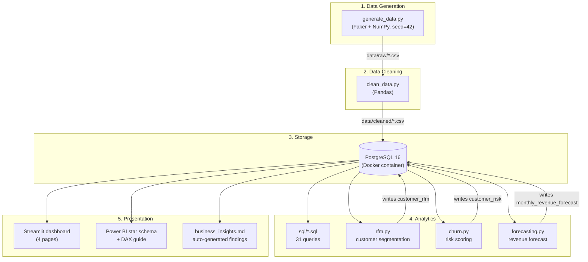
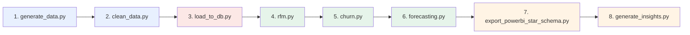
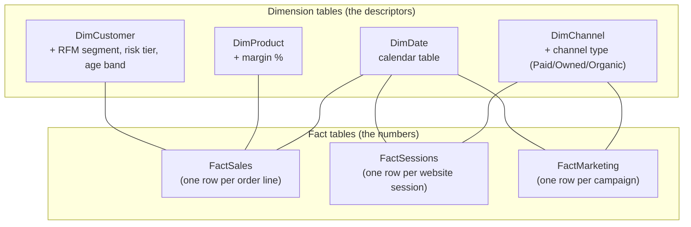
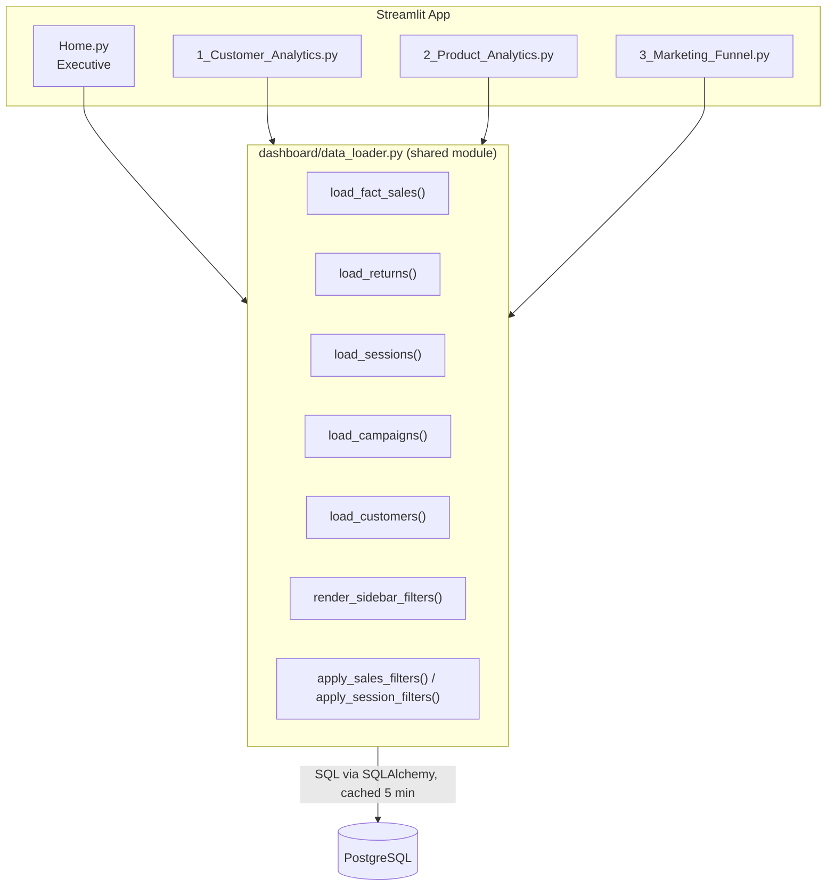
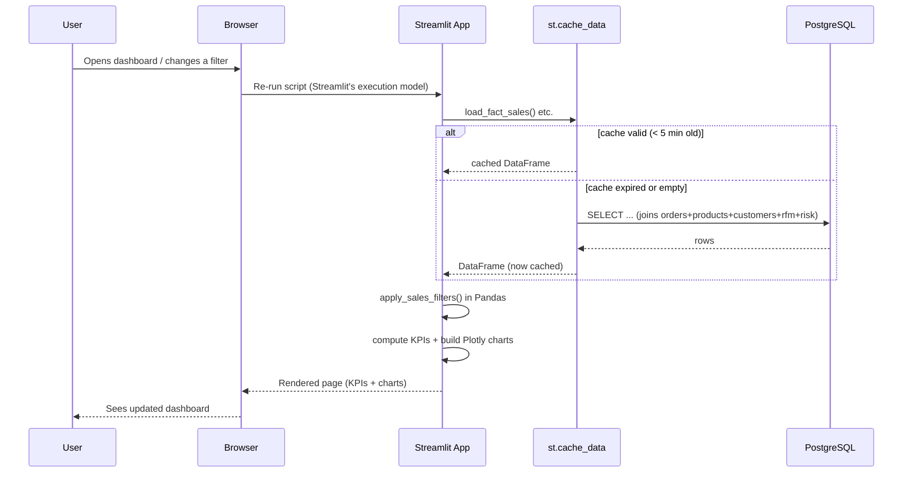
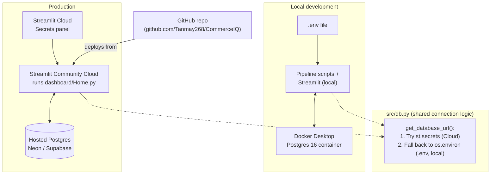

# CommerceIQ — Architecture

This document explains **how the system is built and how data moves through it**,
in plain language, with diagrams. If you want the *why* behind each choice
(not just the *what*), see [`decisions.md`](decisions.md).

---

## 1. What this project is, in one paragraph

CommerceIQ is a self-contained e-commerce analytics platform. A Python script
generates a realistic (but fake) e-commerce dataset — customers, products,
orders, payments, returns, marketing campaigns, website sessions. That data
is cleaned, loaded into a PostgreSQL database, and then analyzed three ways:
31 hand-written SQL queries, three Python analytics modules (customer
segmentation, churn risk, revenue forecasting), and a 4-page interactive
Streamlit dashboard. A Power BI–ready export is generated as a bonus
deliverable. Every stage is a small, testable script chained together by one
orchestrator (`run_all.py`).

---

## 2. Tech stack

| Layer | Technology | Why (short version) |
|---|---|---|
| Data generation | Python, Faker, NumPy | No real dataset exists; a seeded generator makes fake-but-realistic, reproducible data |
| Data cleaning | Pandas | Industry-standard for tabular cleaning; every fix is logged |
| Database | PostgreSQL 16 (via Docker) | Matches the project's target skill set (real relational DB, not a file-based DB) |
| Analytics (SQL) | 31 raw SQL queries | Demonstrates joins, CTEs, and window functions directly |
| Analytics (Python) | Pandas, SciPy, statsmodels | RFM segmentation, churn scoring, Holt-linear-trend forecasting |
| Dashboard | Streamlit + Plotly | Fast to build, free to host, fully interactive, testable end-to-end |
| BI bonus deliverable | Power BI (star schema + DAX guide) | Industry-standard BI tool for portfolio credibility |
| Orchestration | A single `run_all.py` script | One command runs the entire pipeline, in dependency order |
| Environment | `venv` + `requirements.txt` | Zero extra tooling beyond what ships with Python |
| Containerization | Docker Compose (Postgres only) | Keeps the database isolated and disposable |
| Hosting (dashboard) | Streamlit Community Cloud | Free, and works directly against a hosted Postgres instance |
| Hosting (database, prod) | Neon or Supabase (hosted Postgres) | Docker doesn't exist on Community Cloud, so the same schema is hosted there instead |

---

## 3. High-level architecture

Everything is organized into four layers: **generate → store → analyze →
present**. Each box below is a real file/module in the repo.



**Read it like this:** raw data is generated once, cleaned once, and loaded
once. Everything downstream — SQL queries, the dashboard, Power BI, the RFM
and churn tables — all reads from (or writes back small result tables to)
the *same* Postgres database. Postgres is the single source of truth for
the whole system.

---

## 4. The pipeline, step by step

`src/run_all.py` runs these 8 scripts in order. Each step depends only on
the step(s) before it — there's no circular dependency.



**What each step actually does:**

1. **`generate_data.py`** — Creates 7 CSVs in `data/raw/`: customers,
   products, orders, payments, returns, marketing_campaigns,
   website_sessions. Deliberately injects messy data (duplicates, bad
   dates, missing values, orphan foreign keys) so the next step has real
   problems to solve.
2. **`clean_data.py`** — Reads the raw CSVs, fixes every issue (drops
   duplicates, fixes negative numbers, normalizes text casing, fills
   missing values sensibly, drops unrecoverable rows), writes
   `data/cleaned/*.csv`, and **appends a full report** of exactly what it
   fixed to `reports/decisions_log.md` — nothing is a silent fix.
3. **`load_to_db.py`** — Applies `sql/00_schema.sql` (creates 10 tables),
   then bulk-loads the cleaned CSVs into Postgres in foreign-key-safe
   order (parents before children), then **verifies** row counts match
   between the CSV and the database.
4. **`rfm.py`** — Reads orders from Postgres, computes Recency/Frequency/
   Monetary metrics per customer, scores each into quintiles, maps the
   scores to a business segment (Champions, At Risk, Lost, etc.), and
   writes the result into a new table, `customer_rfm`.
5. **`churn.py`** — Computes a simple, explainable, rule-based risk tier
   per customer (Active / Watch / At Risk / Lost / Never Purchased) based
   on days since last order and total order count. Writes to
   `customer_risk`.
6. **`forecasting.py`** — Aggregates monthly revenue, fits a Holt
   linear-trend exponential smoothing model, forecasts the next 3 months,
   and writes both the actuals and the forecast to
   `monthly_revenue_forecast`. Also saves a chart to `reports/figures/`.
7. **`export_powerbi_star_schema.py`** — Re-shapes the same Postgres data
   into a proper star schema (4 dimension tables + 3 fact tables) and
   writes it as CSVs Power BI can import directly.
8. **`generate_insights.py`** — Runs real queries against the finished
   database and writes `reports/business_insights.md` — a Finding +
   Recommendation for each of 4 business questions. Every number in that
   file comes from a live query, not from typing.

---

## 5. Database schema (Entity-Relationship Diagram)

10 tables total: **7 source tables** (loaded straight from the cleaned
CSVs) and **3 analytics tables** (populated later by the Python modules).

```mermaid
erDiagram
    customers ||--o{ orders : "places"
    customers ||--o{ website_sessions : "browses"
    customers ||--o| customer_rfm : "scored as"
    customers ||--o| customer_risk : "scored as"
    products ||--o{ orders : "ordered in"
    orders ||--o| payments : "paid via"
    orders ||--o{ returns : "may have"

    customers {
        varchar customer_id PK
        varchar customer_name
        varchar gender
        int age
        varchar city
        varchar state
        date signup_date
        varchar customer_segment "membership tier: Regular/Premium/VIP"
    }

    products {
        varchar product_id PK
        varchar product_name
        varchar category
        varchar subcategory
        varchar brand
        numeric unit_cost
        numeric selling_price
    }

    orders {
        varchar order_id PK
        varchar customer_id FK
        date order_date
        varchar product_id FK
        int quantity
        numeric discount
        numeric shipping_cost
        varchar payment_method
        varchar order_status
    }

    payments {
        varchar payment_id PK
        varchar order_id FK
        date payment_date
        numeric amount
        varchar payment_status
    }

    returns {
        varchar return_id PK
        varchar order_id FK
        date return_date
        varchar return_reason
        numeric refund_amount
    }

    marketing_campaigns {
        varchar campaign_id PK
        varchar campaign_name
        varchar channel
        date start_date
        date end_date
        numeric spend
        bigint impressions
        bigint clicks
        bigint conversions
    }

    website_sessions {
        varchar session_id PK
        varchar customer_id FK "nullable: anonymous session"
        date session_date
        varchar channel
        varchar device
        int pages_viewed
        boolean added_to_cart
        boolean purchased
    }

    customer_rfm {
        varchar customer_id PK-FK
        int recency_days
        int frequency
        numeric monetary
        int r_score
        int f_score
        int m_score
        varchar rfm_segment
    }

    customer_risk {
        varchar customer_id PK-FK
        int days_since_last_order
        int total_orders
        varchar risk_tier
    }
```

**Two things worth noticing:**

- **`marketing_campaigns` and `website_sessions` are not directly linked to
  `orders`.** There's no `campaign_id` or `channel` column on the `orders`
  table. This mirrors a very common real-world limitation: e-commerce
  platforms often can't cleanly attribute a specific order to a specific ad
  click. Because of this, all channel-level ROAS/CAC numbers in this
  project are a **documented proxy** (conversions × average order value),
  not true order-level attribution. This is called out explicitly
  everywhere it matters (code comments, the Power BI guide, the insights
  report).
- **`customer_rfm` and `customer_risk` are not populated by the schema
  file.** They start empty when `00_schema.sql` runs, and only get filled
  in by `rfm.py` and `churn.py` later in the pipeline — that's why
  `load_to_db.py` runs before them in `run_all.py`.

---

## 6. Power BI star schema (bonus deliverable)

`export_powerbi_star_schema.py` re-shapes the same underlying data into a
classic star schema — the layout Power BI (and most BI tools) expect for
fast, simple drag-and-drop reporting.



`FactSales` connects to `DimCustomer`, `DimProduct`, and `DimDate`.
`FactSessions` and `FactMarketing` connect to `DimDate` and `DimChannel`,
but **not directly to `FactSales`** — for the same attribution reason
explained above. Power BI users would build channel-level metrics as
approximations, which the accompanying `powerbi/dax_measures.md` guide
states plainly rather than hiding.

---

## 7. Dashboard architecture

The dashboard is a **multi-page Streamlit app**. Streamlit auto-discovers
pages from the `dashboard/pages/` folder, so `dashboard/Home.py` is the
"Executive" landing page and each file in `pages/` becomes another tab in
the sidebar.



**Design choices that matter here:**

- **One shared `data_loader.py`, not one per page.** Every page calls the
  same five loader functions and the same two filter functions. This
  means the sidebar filters (date range, state, category, product, RFM
  segment, membership tier, channel, device) behave identically on every
  page — a filter chosen on one page's sidebar re-applies when you
  navigate to another.
- **Cache, don't re-query.** `@st.cache_data(ttl=300)` means each loader
  pulls its *entire* table from Postgres once every 5 minutes and keeps it
  in memory. All filtering then happens in Pandas, in-browser-server
  memory — not as repeated SQL queries. This is a deliberate trade-off:
  fine at this data volume (a few thousand rows), but would need to
  change (push filtering down into SQL, add pagination) at real
  production scale.
- **Fail loud, not silent.** Every page checks `if sales_completed.empty:
  st.warning(...); st.stop()` — if a filter combination returns zero rows,
  the user sees a clear message instead of a broken chart.

### Request flow (sequence diagram)



---

## 8. Deployment architecture

There are two environments: **local development** (Docker Postgres) and
**production** (Streamlit Community Cloud, which has no Docker, so it
needs a hosted database instead). `src/db.py` is what makes the same code
work in both places.



**How production deployment actually works, step by step:**

1. Provision a free hosted Postgres (Neon or Supabase) — get a connection
   string.
2. Point the local `.env` at that hosted DB temporarily and run
   `run_all.py` once, so the hosted database gets populated with the same
   pipeline that built the local one.
3. Push the repo to GitHub.
4. Create a Streamlit Community Cloud app pointed at
   `dashboard/Home.py`.
5. Paste the hosted DB's connection string into the app's **Secrets**
   panel as `DATABASE_URL`.
6. Streamlit Cloud runs the app; `db.py` automatically detects it's
   running under Streamlit and reads `st.secrets` instead of `.env`.

This means **the exact same dashboard code runs unmodified** in both
environments — only where the connection string comes from changes.

---

## 9. Project folder structure

```
CommerceIQ/
├── data/
│   ├── raw/            synthetic CSVs, messy on purpose (generator output)
│   └── cleaned/         same tables, cleaned (cleaner output, what gets loaded to DB)
├── src/                 pipeline scripts, run in dependency order by run_all.py
│   ├── generate_data.py
│   ├── clean_data.py
│   ├── db.py             shared Postgres connection helper (local + cloud)
│   ├── load_to_db.py
│   ├── rfm.py
│   ├── churn.py
│   ├── forecasting.py
│   ├── export_powerbi_star_schema.py
│   ├── generate_insights.py
│   ├── run_sql_files.py  runs all 31 SQL queries as a smoke test
│   └── run_all.py        orchestrates every step above, in order
├── sql/                 31 analysis queries, split into 5 domain files
│   ├── 00_schema.sql
│   ├── 01_revenue_analysis.sql
│   ├── 02_customer_analysis.sql
│   ├── 03_product_analysis.sql
│   ├── 04_marketing_analysis.sql
│   └── 05_advanced_analysis.sql
├── notebooks/            EDA, RFM, product profitability, marketing/funnel, forecasting
├── dashboard/
│   ├── Home.py            Executive page (entry point)
│   ├── data_loader.py     shared cached queries + filter logic
│   └── pages/
│       ├── 1_Customer_Analytics.py
│       ├── 2_Product_Analytics.py
│       └── 3_Marketing_Funnel.py
├── powerbi/
│   ├── dax_measures.md            full DAX measure library + build guide
│   └── star_schema_export/*.csv   ready-to-import star schema
├── reports/
│   ├── decisions_log.md   raw, chronological, auto-appended decision + cleaning log
│   ├── business_insights.md  auto-generated findings (real numbers, not hand-written)
│   └── figures/            saved charts (e.g. the forecast plot)
├── .streamlit/
│   └── secrets.toml.example  template for Streamlit Cloud secrets
├── docker-compose.yml    Postgres service definition (local dev only)
└── requirements.txt
```

---

## 10. Key design characteristics (the "-ilities")

| Characteristic | How it's achieved |
|---|---|
| **Reproducibility** | Every random generator is seeded (`SEED = 42`). Re-running `generate_data.py` produces byte-identical output every time. |
| **Auditability** | `clean_data.py` never silently fixes anything — every transformation is counted and logged with before/after row counts, appended to `reports/decisions_log.md`. |
| **Idempotency** | `load_to_db.py` drops and recreates all tables from scratch (`00_schema.sql` starts with `DROP TABLE IF EXISTS ... CASCADE`); `rfm.py` / `churn.py` / `forecasting.py` each `DELETE FROM` their table before writing. Re-running the pipeline never duplicates data. |
| **Verifiability** | `load_to_db.py` asserts CSV row counts equal DB row counts after loading. `run_sql_files.py` executes all 31 queries as a smoke test. |
| **Separation of concerns** | Each pipeline stage is a standalone script that only reads/writes well-defined inputs/outputs — cleaning doesn't know about the dashboard, the dashboard doesn't know about the generator. |
| **Environment portability** | `src/db.py` merges `st.secrets` over `os.environ`, so the same code runs locally (Docker + `.env`) and in the cloud (Streamlit secrets + hosted Postgres) with zero code changes. |
| **Honesty about limitations** | Marketing attribution is explicitly labeled as a proxy model everywhere it appears (code comments, DAX guide, insights report) rather than presented as more precise than it is. |
